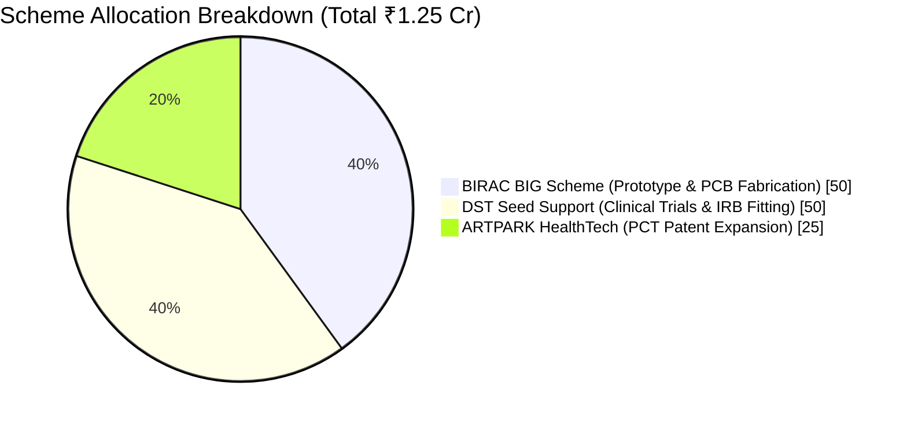

# 📊 PROJECT PHOENIX: GRANT PITCH DECK & INVESTMENT PROPOSAL

**Applicant & Lead Engineer**: R. Karthick Raja  
**Location**: Pasumpon Nagar, Vadipatti Road, Sholavandan, Madurai, Tamil Nadu, India - 625214  
**Patent Reference**: Indian Provisional Patent Application No. 202641077314 (Filed 23 June 2026)  
**Total Funding Request**: ₹1.25 Crore INR ($150,000 USD) across BIRAC, DST, & ARTPARK schemes  

---

## 1. Problem & Clinical Need

Over 90% of transhumeral amputees with skin-grafted residual limbs abandon traditional myoelectric prosthetics within 6 months. High socket shear forces (>15 kPa), sweating, contact dermatitis, and heavy weight (2.5 kg+) cause skin graft tears and excruciating pain.

---

## 2. Solution: Project Phoenix (Gen 2)

Project Phoenix is a 1.18 kg autonomous prosthetic arm featuring:
1. **FSR Socket Pressure Interlock**: Automatic passive lock at 20.0 kPa to protect skin graft beds.
2. **100% Offline Syntiant NDP120 AI Processor**: Gesture classification in 22ms at <4.8mW power.
3. **Sweat Cortisol Stress Biosensing**: Microfluidic sensor capping grip torque at 80% during high stress.
4. **Self-Healing Socket Liner**: Nickel-particle hybrid polymer repairing micro-cracks in 10 mins.

---

## 3. Scheme-by-Scheme Budget Allocation (Total Ask: ₹1.25 Crore INR)

| Scheme Name | Requested Funding | Specific Execution Focus |
| :--- | :--- | :--- |
| **BIRAC BIG (Biotechnology Ignition Grant)** | **₹50 Lakhs INR** | Physical PCB fabrication, Maxon EC16 motor procurement, and platinum silicone socket tooling |
| **DST Seed Support Scheme** | **₹50 Lakhs INR** | IRB-approved clinical fitting trials with 10 transhumeral amputee patients |
| **ARTPARK HealthTech Grant** | **₹25 Lakhs INR** | International PCT Patent Expansion (US, EU, and WIPO PCT regional filings) |

---

## 4. Clinical & Hardware Roadmap (Q3 2026 - Q2 2027)

* **Phase 1 (Completed)**: Indian Provisional Patent Application No. 202641077314 Filed (23 June 2026).
* **Phase 2 (Current - Q3 2026)**: Digital Twin HIL Physics Model & Web Showcase Platform.
* **Phase 3 (Planned - Q4 2026)**: Physical STM32 PCB Fabrication & Maxon EC16 Motor Assembly.
* **Phase 4 (Planned - Q1 2027)**: Bench Hardware-in-the-Loop Testing with TI ADS1299 / Otto Bock 13E200 AFE & FSR Sensors.
* **Phase 5 (Planned - Q2 2027)**: Clinical Trial & Patient Fitting with n=10 Transhumeral Amputees.

---

© 2026 R. Karthick Raja. All Rights Reserved except where licensed under the software MIT License.
