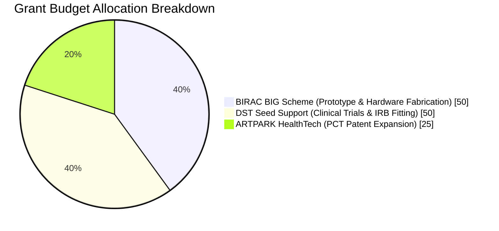

# 💼 PROJECT PHOENIX: GRANT SUBMISSION & INVESTOR PACKAGE

**Applicant & Lead Engineer**: R. Karthick Raja  
**Location**: Pasumpon Nagar, Vadipatti Road, Sholavandan, Madurai, Tamil Nadu, India - 625214  
**Patent Reference**: Indian Provisional Patent Application No. 202641077314 (Filed 23 June 2026)  
**Total Funding Request**: ₹1.25 Crore INR (~$150,000 USD)  

---

## 1. Executive Summary & Value Proposition

Project Phoenix is an **Autonomous Transhumeral (Above-Elbow) Myoelectric Prosthetic Arm** in active development for amputees with skin-grafted residual limbs. It integrates offline neural AI processing (Syntiant NDP120), vision-EMG intent fusion, sweat cortisol emotion-aware grip control, self-healing polymer socket liners, and mandatory muscle rest protocols. Verified bill-of-materials cost is $6,468.60 (~₹5.4 Lakhs) against $50,000+ for comparable commercial devices — a ~7.7x reduction. The design targets alignment with EU AI Act and IEC 60601-1 requirements; formal compliance determination requires physical testing and has not yet been completed.

> [!NOTE]
> **Execution Clarification**: Software, firmware drivers, and 3D CAD blueprints are complete and verified via System-Level Computational Verification (digital-twin simulation). Regulatory documentation is drafted and pending review by a qualified consultant. Physical hardware fabrication, bench HIL testing, and clinical patient trials remain planned for Q4 2026 – Q2 2027.

---

## 2. Complete Submission File & CAD Inventory Index

| Document / Asset Title | File Location | Content & Taxonomy Summary |
| :--- | :--- | :--- |
| **Technical Whitepaper** | [`PROJECT_WHITEPAPER.md`](./PROJECT_WHITEPAPER.md) | Technical specs, system block diagrams, & 13 patent novelty claims |
| **Grant Pitch Deck** | [`GRANT_PITCH_DECK.md`](./GRANT_PITCH_DECK.md) | Scheme allocation (BIRAC ₹50L + DST ₹50L + ARTPARK ₹25L) & roadmap |
| **EU AI Act & Safety Assessment** | [`EU_AI_ACT_COMPLIANCE.md`](./EU_AI_ACT_COMPLIANCE.md) | Design-stage mapping to EU AI Act Articles 10/14/15 and IEC 60601-1 — not an accredited audit |
| **Mechanical Assembly Index** | [`MECHANICAL_ASSEMBLY_GUIDE.md`](./MECHANICAL_ASSEMBLY_GUIDE.md) | 47 KCL Master Script Files generating 88 Physical Parts, 92 Subsystem Components, & 326 Total Solid Bodies |
| **Embedded Firmware Code** | `firmware/` | C/C++ safety system, rest timer, sEMG DSP, & motor PID drivers (written, not yet hardware-tested) |
| **Interactive Dashboard** | `dashboard/` | Runnable Vite + React web simulation & 3D WebGL viewer |
| **GitHub Source Repository** | [GitHub Repository](https://github.com/karthickraja2371-rgb/project-phoenix-dashboard.git) | Source code repository for continuous integration |
| **Live Showcase Site** | [Live Showcase](https://project-phoenix-isslsot1z-project-phoenix2.vercel.app/) | Live digital-twin demo, permanent deployment |

---

## 3. Financial & Grant Scheme Allocation (Total ₹1.25 Crore INR)

---

## 4. Immediate Next Milestones (Q3 2026 - Q2 2027)

- **Q3 2026**: Submit BIRAC BIG & DST Seed Support applications; publish web showcase.
- **Q4 2026**: Manufacture physical platinum silicone socket mold and fabricate STM32H753 PCB.
- **Q1 2027**: Conduct physical bench HIL testing of the Otto Bock 13E200 sEMG signal chain and FSR load cells.
- **Q2 2027**: Initiate IRB-approved clinical pilot fitting with 10 transhumeral amputee patients.

*Open item: whether a dedicated external analog front-end chip is added to the sEMG signal path (beyond the electrodes' onboard amplification) is still an open design decision — to be resolved before Q1 2027 bench testing, with the BOM updated accordingly if so.*

---

© 2026 R. Karthick Raja. All Rights Reserved except where licensed under explicit written agreement.
