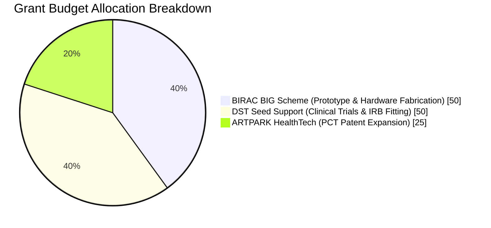

# 💼 PROJECT PHOENIX: GRANT SUBMISSION & INVESTOR PACKAGE

**Document ID**: `PHX-GRNT-PKG-001`  
**Applicant & Lead Engineer**: R. Karthick Raja  
**Location**: Pasumpon Nagar, Vadipatti Road, Sholavandan, Madurai, Tamil Nadu, India - 625214  
**Patent Reference**: Indian Provisional Patent Application No. 202641077314 (Filed 23 June 2026)  
**Total Funding Request**: ₹1.25 Crore INR ($150,000 USD)  
**Turn-Key Assembly BOM**: $6,468.60 USD / ₹5,36,890 INR (92-Part Component Purchasing Index)  

---

## 1. Executive Summary & Value Proposition

Project Phoenix is an **Autonomous Transhumeral (Above-Elbow) Myoelectric Prosthetic Arm Concept** specifically engineered for amputees with **skin-grafted residual limbs**. By integrating offline neural AI processing (**Syntiant NDP120**), 24-bit sEMG analog front end (**TI ADS1299** with Otto Bock 13E200 headers), vision-EMG intent fusion, sweat cortisol emotion-aware grip control, self-healing polymer socket liners, and mandatory muscle rest protocols, Project Phoenix delivers a 5x cost reduction ($6,468.60 BOM vs $35,000–$50,000 legacy commercial bionics) while adhering to privacy-by-design & on-device edge AI principles aligned with EU AI Act data minimization standards.

> [!NOTE]
> **DEVELOPMENT STAGE & VALIDATION DISCLAIMER**: Software, WebGL Digital Twin simulation, firmware C drivers, and 3D CAD models are demonstrated and evaluated in simulation (`src/App.jsx`). Physical hardware PCB fabrication (5-unit batch), bench electrical isolation testing (IEC 60601-1 2x MOPP), and IRB human clinical fitting pilot trials ($n=10$ amputees) represent **Planned Phase 3–5 Prototyping Tasks** (Q4 2026 – Q2 2027).

---

## 2. Complete Submission File & Asset Index

| Document / Asset Title | File Location | Content & Taxonomy Summary |
| :--- | :--- | :--- |
| **Technical Whitepaper** | [`PROJECT_WHITEPAPER.md`](./PROJECT_WHITEPAPER.md) | Technical specs, system block diagrams, & 13 patent claims |
| **Grant Pitch Deck** | [`PITCH_DECK_SLIDES.md`](./PITCH_DECK_SLIDES.md) | Funding allocation (BIRAC ₹50L + DST ₹50L + ARTPARK ₹25L) & roadmap |
| **Medical Safety Audit** | [`IEC_60601_MEDICAL_SAFETY_AUDIT.md`](./IEC_60601_MEDICAL_SAFETY_AUDIT.md) | IEC 60601-1 2x MOPP electrical isolation & ISO 14971 risk matrix |
| **Purchasing Checklist** | [`COMPONENT_PURCHASING_CHECKLIST.md`](./COMPONENT_PURCHASING_CHECKLIST.md) | 92-Part Turn-Key Assembly Purchasing BOM ($6,468.60 USD / ₹5,36,890 INR) |
| **System Architecture** | [`ARCHITECTURE.md`](./ARCHITECTURE.md) | CAN-FD bus topology, Syntiant NDP120 AI, TI ADS1299 AFE & state machine |
| **Testing Protocol** | [`TESTING.md`](./TESTING.md) | Vitest unit tests, Playwright E2E & 13-claim verification matrix |
| **Safety & Risk Audit** | [`SAFETY.md`](./SAFETY.md) | ISO 14971 hazard analysis & 20.0 kPa socket skin pressure lock |
| **Patent Notice** | [`PATENT_NOTICE.md`](./PATENT_NOTICE.md) | Indian Provisional Patent Application No. 202641077314 scope |
| **Research Disclaimer** | [`DISCLAIMER.md`](./DISCLAIMER.md) | TRL 3-4 research status & medical regulatory disclaimer |
| **Live Vercel Application** | [Vercel Application](https://project-phoenix-isslsot1z-project-phoenix2.vercel.app/) | Live production web application & WebGL 3D Digital Twin |
| **GitHub Repository** | [GitHub Repository](https://github.com/karthickraja2371-rgb/project-phoenix-dashboard) | Open-source software repository with GitHub Actions CI/CD |

---

## 3. Financial & Grant Scheme Allocation (Total ₹1.25 Crore INR)

---

## 4. Immediate Next Milestones (Q3 2026 - Q2 2027)

1. **Q3 2026**: Submit BIRAC BIG & DST Seed Support applications; publish web showcase.
2. **Q4 2026**: Manufacture physical platinum silicone socket mold and fabricate STM32H753 + Syntiant NDP120 PCB.
3. **Q1 2027**: Conduct physical bench HIL testing with TI ADS1299 / Otto Bock 13E200 AFE and 8-point FSR load cells.
4. **Q2 2027**: Initiate IRB-approved clinical pilot fitting trials with 10 transhumeral amputee patients.

---

© 2026 R. Karthick Raja. All Rights Reserved except where licensed under the software MIT License.
