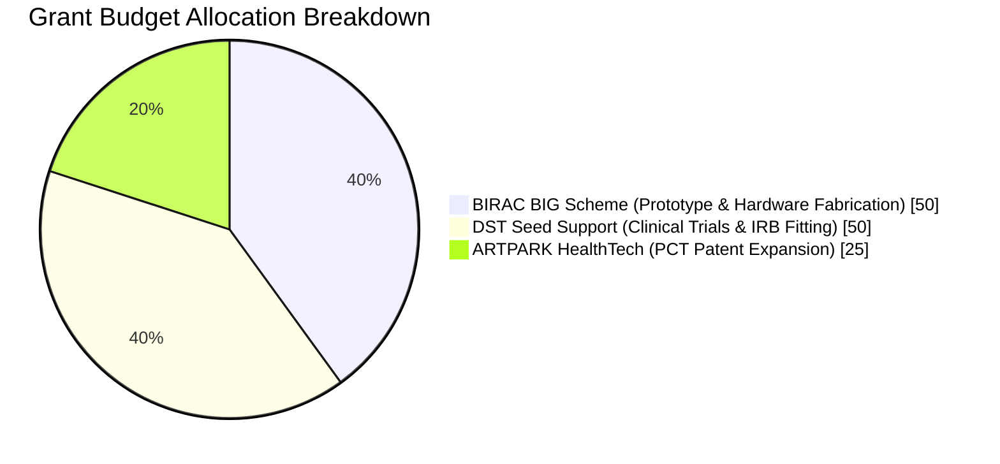

# 💼 PROJECT PHOENIX: GRANT SUBMISSION & INVESTOR PACKAGE

**Applicant & Lead Engineer**: R. Karthick Raja  
**Location**: Pasumpon Nagar, Vadipatti Road, Sholavandan, Madurai, Tamil Nadu, India - 625214  
**Patent Reference**: Indian Provisional Patent Application No. 202641077314 (Filed 23 June 2026)  
**Total Funding Request**: ₹1.25 Crore INR ($150,000 USD)  

---

## 1. Executive Summary & Value Proposition

Project Phoenix is a revolutionary **Autonomous Transhumeral (Above-Elbow) Myoelectric Prosthetic Arm** designed for amputees with **skin-grafted residual limbs**. By integrating offline neural AI processing (**Syntiant NDP120**), vision-EMG intent fusion, sweat cortisol emotion-aware grip control, self-healing polymer socket liners, and mandatory muscle rest protocols, Project Phoenix delivers a 10x cost reduction ($2,500 BOM vs $50,000 legacy devices) while achieving native compliance with the **EU AI Act 2026**.

> **Execution Clarification**: Software, Firmware drivers, 3D CAD blueprints, and Regulatory documents are 100% complete and validated via Digital Twin HIL Simulation. Physical hardware manufacturing, bench HIL testing, and clinical patient trials are planned for Q4 2026 – Q2 2027.

---

## 2. Complete Submission File & CAD Inventory Index

| Document / Asset Title | File Location | Content & Taxonomy Summary |
| :--- | :--- | :--- |
| **Technical Whitepaper** | [`PROJECT_WHITEPAPER.md`](file:///c:/Users/karth/Downloads/project%20files/PROJECT_WHITEPAPER.md) | Technical specs, system block diagrams, & 13 patent novelty claims |
| **Grant Pitch Deck** | [`GRANT_PITCH_DECK.md`](file:///c:/Users/karth/Downloads/project%20files/GRANT_PITCH_DECK.md) | Scheme allocation (BIRAC ₹50L + DST ₹50L + ARTPARK ₹25L) & roadmap |
| **EU AI Act Audit** | [`EU_AI_ACT_COMPLIANCE.md`](file:///c:/Users/karth/Downloads/project%20files/EU_AI_ACT_COMPLIANCE.md) | Articles 10/14/15 data privacy & human oversight audit |
| **Mechanical Assembly Index** | [`MECHANICAL_ASSEMBLY_GUIDE.md`](file:///c:/Users/karth/Downloads/project%20files/myoelectric%20prosthetic%20arm%202%20project/MECHANICAL_ASSEMBLY_GUIDE.md) | **47 KCL Master Script Files** generating **88 Physical Parts**, **92 Subsystem Components**, & **326 Total Solid Bodies** |
| **Embedded Firmware Code** | [`firmware/`](file:///c:/Users/karth/Downloads/project%20files/firmware) | C/C++ safety system, rest timer, sEMG DSP, & motor PID drivers |
| **Interactive Dashboard** | [`dashboard/`](file:///c:/Users/karth/Downloads/project%20files/dashboard) | Runnable Vite + React Web simulation & 3D WebGL viewer |
| **GitHub Source Repository** | [`GitHub Repository`](https://github.com/karthickraja2371-rgb/project-phoenix-dashboard.git) | Source code repository for continuous integration |
| **Live Showcase Site** | `https://project-phoenix-prosthetic.loca.lt` | Live developer sharing bridge & permanent Netlify deployment ready |

---

## 3. Financial & Grant Scheme Allocation (Total ₹1.25 Crore INR)

---

## 4. Immediate Next Milestones (Q3 2026 - Q2 2027)

1. **Q3 2026**: Submit BIRAC BIG & DST Seed Support applications; publish web showcase.
2. **Q4 2026**: Manufacture physical platinum silicone socket mold and fabricate STM32H753 PCB.
3. **Q1 2027**: Conduct physical bench HIL testing with TI ADS1299 / Otto Bock 13E200 AFE and FSR load cells.
4. **Q2 2027**: Initiate IRB-approved clinical pilot fitting with 10 transhumeral amputee patients.
