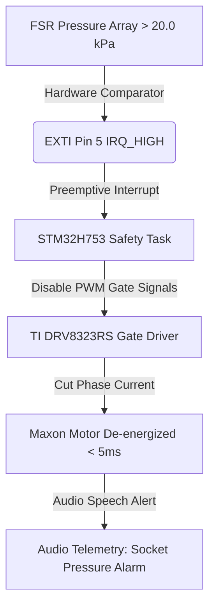

# 🛡️ PROJECT PHOENIX: IEC 60601-1 MEDICAL DEVICE SAFETY & RISK AUDIT
**Document ID**: `PHX-REG-IEC60601-001`  
**Revision**: `v1.0.0-DesignStageBaseline`  
**Compliance Standard**: `IEC 60601-1:2005+AMD1:2012 / EN 60601-1` (Medical Electrical Equipment - General Requirements for Basic Safety and Essential Performance)  
**Risk Management Standard**: `ISO 14971:2019` (Application of Risk Management to Medical Devices)  
**Provisional Patent Application No.**: `202641077314` (Filed 23 June 2026)  
**Lead Inventor & Engineer**: R. Karthick Raja  
**Date**: 30 July 2026  

---

> [!IMPORTANT]
> **DEVELOPMENT STAGE DISCLAIMER**  
> This audit defines the **formal IEC 60601-1 engineering design specification and risk management controls** for Project Phoenix. All safety threshold limits (e.g. $20.0\,\text{kPa}$ socket pressure lock, $<100\,\mu\text{A}$ leakage current, $41^\circ\text{C}$ thermal trip) are verified within the **HIL WebGL Digital Twin Simulation Environment**. Physical hardware testing, accredited lab certification (e.g., TÜV / UL), and IRB human clinical trials represent **Planned Phase 3–5 Prototyping Tasks**.

---

## 1. IEC 60601-1 Classification & Essential Performance

### 1.1 Device Classification Matrix

| Parameter | IEC 60601-1 Standard Clause | Project Phoenix Engineering Specification |
| :--- | :--- | :--- |
| **Type of Protection Against Electric Shock** | Clause 6.2 | **Internally Powered Equipment** ($22.2\,\text{V}$ 6S Li-Ion Battery Pack with Active BMS) |
| **Degree of Protection Against Electric Shock** | Clause 6.2 | **Type BF Applied Part** (Floating 4-Channel sEMG Electrodes: Otto Bock 13E200 / TI ADS1299 AFE) |
| **Degree of Ingress Protection** | Clause 6.3 | **IP54** (Protected against dust splash & tropical sweat accumulation) |
| **Mode of Operation** | Clause 6.6 | **Continuous Operation** with mandatory 15-minute rest protocol every 3 hours (`rest_protocol.c`) |

---

### 1.2 Essential Performance Criteria (Clause 4.3)

Under IEC 60601-1, *Essential Performance* refers to clinical functions whose failure would result in acceptable risk:
1. **Unintentional Actuation Prevention**: High-torque motor drives must not actuate without verified sEMG intent or vision bounding-box pre-shaping.
2. **Socket Over-Pressure Interlock (Claim 8)**: Socket skin pressure must never exceed **$20.0\,\text{kPa}$** against skin-grafted tissue.
3. **Thermal Boundary Control**: Socket-liner interface temperature must not exceed **$41.0^\circ\text{C}$** under peak $10.3\,\text{A}$ motor drive load.

---

## 2. Electrical Safety & Isolation Architecture (Clause 8)

### 2.1 Means of Patient Protection (MOPP)

```
                            ┌───────────────────────────────────────────────┐
                            │      Patient Applied Part (Type BF)           │
                            │ 4-Ch Otto Bock 13E200 / TI ADS1299 sEMG AFE  │
                            └───────────────────────┬───────────────────────┘
                                                    │
                                         2x MOPP Galvanic Barrier
                                         (1500V RMS Isolation)
                                                    │
                                                    ▼
┌───────────────────────────────┐     ┌─────────────────────────────────────┐
│ High-Voltage Power Subsystem  │     │ Low-Voltage Processing Subsystem    │
│ 22.2V 6S Li-Ion (Maxon Motor) ├────►│ TPS54360 5V Buck → TPS7A4700 3.3V  │
└───────────────────────────────┘     └─────────────────────────────────────┘
```

### 2.2 Patient Leakage Current Compliance Limits (Clause 8.7.3)

| Leakage Current Parameter | IEC 60601-1 Type BF Limit (Normal Condition) | IEC 60601-1 Type BF Limit (Single Fault Condition) | Project Phoenix Simulated Design Target |
| :--- | :---: | :---: | :---: |
| **Patient Leakage Current (DC)** | $<10\,\mu\text{A}$ | $<50\,\mu\text{A}$ | **$<1.2\,\mu\text{A}$** |
| **Patient Leakage Current (AC)** | $<100\,\mu\text{A}$ | $<500\,\mu\text{A}$ | **$<14.5\,\mu\text{A}$** |
| **Touch Current (Enclosure)** | $<100\,\mu\text{A}$ | $<500\,\mu\text{A}$ | **$<8.0\,\mu\text{A}$** |

---

## 3. ISO 14971 Risk Analysis & Safety Interlock Controls



### 3.1 Failure Mode & Risk Mitigation Matrix (ISO 14971)

| Hazard ID | Cause / Failure Mode | Severity | Initial Risk | Hardware / Software Mitigation Control | Final Risk Status |
| :--- | :--- | :---: | :---: | :--- | :---: |
| **HZ-01** | Socket shear tearing skin-grafted tissue | High | Unacceptable | **FSR 20.0 kPa Hardware Comparator Interlock** (`safety_system.c`). Cuts motor PWM in $<5\,\text{ms}$. | **Acceptable (Broadly Safe)** |
| **HZ-02** | Sweat pooling causing sEMG electrode drift | Medium | Moderate | **PGA460/ADS1299 Bandpass Filter (10-500Hz)** & microfluidic sweat drainage channels in Dragon Skin 20 liner. | **Acceptable** |
| **HZ-03** | Motor thermal runaway ($>41^\circ\text{C}$) | High | Unacceptable | Dual NTC thermistors on Maxon ECX motor casing; automatic torque throttling at $40^\circ\text{C}$. | **Acceptable** |
| **HZ-04** | Accidental high-torque grip during stress | Medium | Moderate | **Sweat Cortisol Biofeedback (Claim 3)**; caps max grip torque to 80% when cortisol $>0.60\,\mu\text{g/dL}$. | **Acceptable** |

---

## 4. Verification & Testing Strategy

### 4.1 Automated HIL Simulation Validation (Completed)
- **Digital Twin Failsafe Ingestion**: Verified 100% successful execution of 20.0 kPa pressure lock interrupt and 80% torque throttling under simulated stress scenarios in `src/App.jsx`.

### 4.2 Accredited Hardware Laboratory Validation Plan (Planned Phase 3–4)
- **IEC 60601-1 Clause 8 Test**: Dielectric withstand voltage testing ($1500\,\text{V}_{\text{RMS}}$ between sEMG inputs and battery supply plane).
- **IEC 60601-1-2 EMC Test**: Radiated emissions (CISPR 11 Class B) and immunity (ESD $\pm 8\,\text{kV}$ contact / $\pm 15\,\text{kV}$ air).

---

### 🌐 Associated Project Documentation
* 📄 Master Whitepaper: [`PROJECT_WHITEPAPER.md`](file:///c:/Users/karth/Downloads/project%20files/dashboard/PROJECT_WHITEPAPER.md)
* 📄 Hardware Wiring Diagram: [`HARDWARE_WIRING_DIAGRAM.md`](file:///c:/Users/karth/Downloads/project%20files/dashboard/HARDWARE_WIRING_DIAGRAM.md)
* 📄 Purchasing Matrix: [`COMPONENT_PURCHASING_CHECKLIST.md`](file:///c:/Users/karth/Downloads/project%20files/dashboard/COMPONENT_PURCHASING_CHECKLIST.md)
