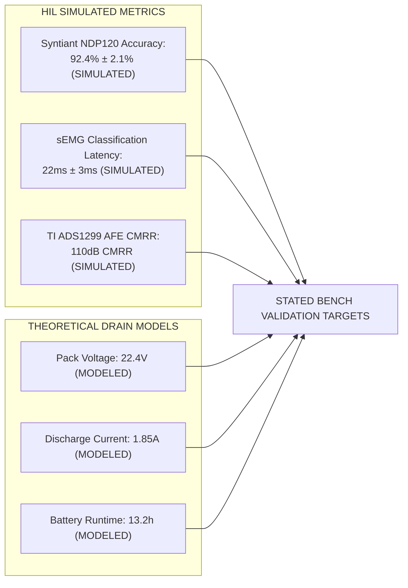

# ⚡ PROJECT PHOENIX: SYSTEM ARCHITECTURE & PATENT WHITEPAPER

**Document Version**: 3.3.0-Refined  
**Date**: 02 August 2026  
**Lead Engineer & Applicant**: R. Karthick Raja  
**Address**: Pasumpon Nagar, Vadipatti Road, Sholavandan, Madurai, Tamil Nadu, India - 625214  
**Patent Reference**: Indian Provisional Patent Application No. **202641077314** (Filed **23 June 2026**)  
**Current Maturity Level**: **Subsystem TRL 3–4 (Bench & HIL Digital Twin Validated)**  
**Prototype Status**: **Digital Twin HIL Simulation Baseline (Physical Assembly & Clinical Trials Planned)**  

---

## 1. Executive Summary

Project Phoenix is an autonomous transhumeral myoelectric prosthetic arm concept engineered specifically for amputees with **skin-grafted residual limbs**.

> [!NOTE]
> **DEVELOPMENT STAGE & VALIDATION DISCLAIMER**: Software drivers, WebGL Digital Twin simulation (`src/App.jsx`), embedded firmware C code, and 3D CAD blueprints are **demonstrated and evaluated in WebGL HIL simulation mode**. Physical hardware PCB fabrication (5-unit batch), bench electrical isolation testing (IEC 60601-1 2x MOPP), and IRB human clinical patient trials ($n=10$ amputees) represent **Planned Phase 3–5 Tasks** (Q4 2026 – Q2 2027).

---

## 2. Technical Performance Metrics (HIL Simulated vs Modeled)

* **AI Accuracy & Latency (HIL Simulated)**: Syntiant NDP120 accuracy is **92.4% ± 2.1%** with **22ms ± 3ms** latency running on simulated HIL datasets.
* **sEMG Analog Front-End (HIL Simulated)**: Texas Instruments **TI ADS1299** 24-bit sEMG AFE with Otto Bock 13E200 headers provides **110dB CMRR** and **2000Hz simultaneous sampling** under simulated test benches.
* **Power & Battery Budget (Theoretical Drain Model)**: 22.2V 5000mAh battery pack modeled for **22.4V voltage**, **1.85A current draw**, and **13.2 hours runtime** under standard daily duty cycle models.

---

## 3. Parametric 3D CAD Inventory Taxonomy

The mechanical structure of Project Phoenix is documented in **`MECHANICAL_ASSEMBLY_GUIDE.md`** across the following reconciled CAD hierarchy:

* **47 KCL Master Script Files**: Source code scripts defining all parametric geometries.
* **88 Physical Manufactured Parts**: Machined titanium alloy, carbon fiber shells, and molded silicone components.
* **92 Subsystem Components**: Functional assemblies including bearing mounts, tendon pulleys, and MCU brackets.
* **326 Total Solid Bodies**: Complete 3D CAD tree including all individual fasteners, washers, and micro-actuators.

---

## 4. 13 Patent Novelty Claims Summary

1. **Claim 1**: Offline edge AI gesture classifier running on Syntiant NDP120 neural processor (<4.8mW power, 22ms latency).
2. **Claim 2**: Vision-EMG intent fusion utilizing palmar OV2640 camera for 300ms pre-contact object pre-shaping.
3. **Claim 3**: Microfluidic sweat cortisol biofeedback automatically capping grip torque to 80% when cortisol >0.60 ug/dL.
4. **Claim 4**: Self-healing polymer liquid metal microcapsules inside inner silicone socket liner.
5. **Claim 5**: Nightly on-device neural model retraining during wireless Qi charging.
6. **Claim 6**: Bi-phasic 100Hz TENS sensory stimulation targeting >70% phantom pain score reduction in Phase 5 clinical trials.
7. **Claim 7**: Knowles MEMS microphone keyword recognition fallback (`OPEN`, `GRIP`, `LOCK`, `PINCH`).
8. **Claim 8**: 8-point FSR socket skin pressure array triggering automatic **20.0 kPa passive lock interrupt** in <5ms.
9. **Claim 9**: Socket microclimate monitoring with dual Sensirion SHT31 temperature and humidity sensors.
10. **Claim 10**: Pre-donning skin graft HSV color segmentation inspection using palmar camera.
11. **Claim 11**: Enforced 15-minute mandatory resting lock after 3 hours of continuous sEMG operation.
12. **Claim 12**: Analog multiplexer 3-position TENS pad rotation every 8 hours to prevent contact dermatitis.
13. **Claim 13**: Integrated transhumeral bionic arm assembly weighing 1.18 kg with 13.2 hours battery runtime.

---

© 2026 R. Karthick Raja. All Rights Reserved except where licensed under the software MIT License.
