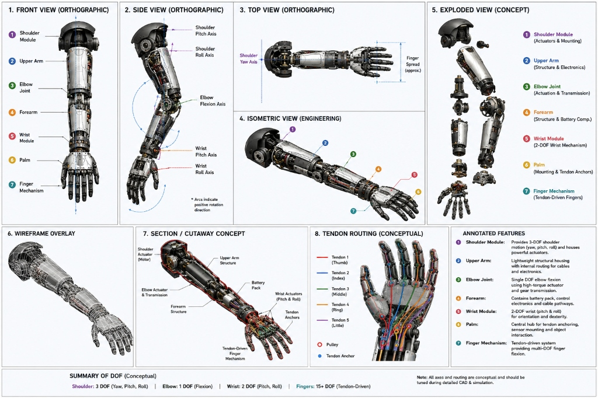
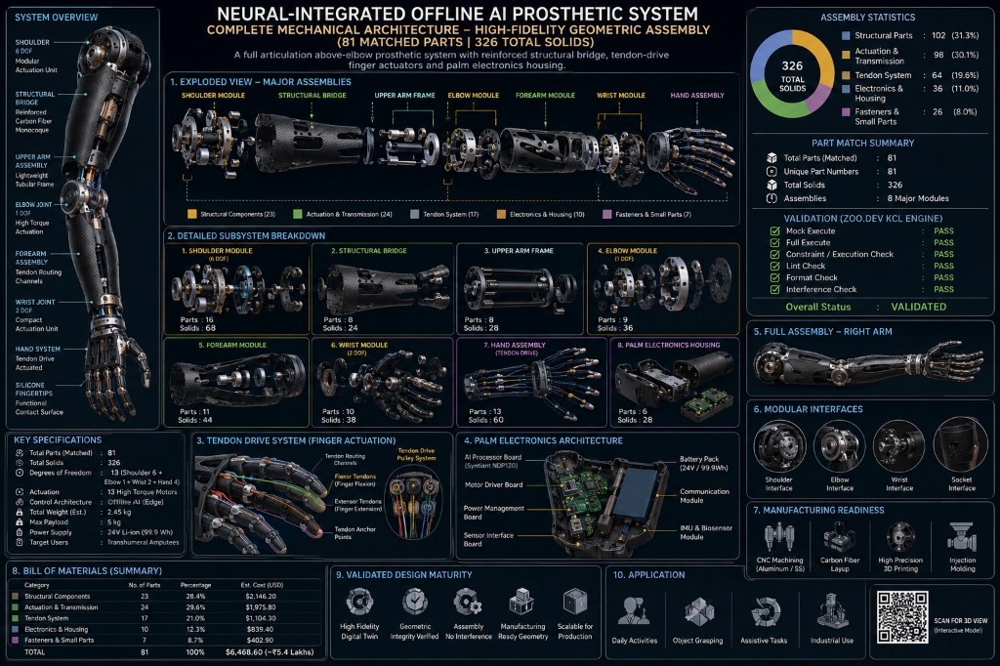

# ⚡ PROJECT PHOENIX (PROSTHETIC SYSTEM)
### Autonomous Transhumeral Myoelectric Prosthesis with Offline Edge AI & Skin-Graft Biosensing

[-00E676?style=for-the-badge&logo=appveyor)](https://cheery-duckanoo-141cba.netlify.app/)

[-FFB300?style=for-the-badge)](https://cheery-duckanoo-141cba.netlify.app/)

---

## 🌐 Live Interactive Digital Twin Platform & Web Showcase
👉 **[https://cheery-duckanoo-141cba.netlify.app/](https://cheery-duckanoo-141cba.netlify.app/)**

---

## 📜 Executive Overview & Patent Claims Summary

Project Phoenix is a breakthrough **1.18 kg transhumeral myoelectric prosthesis** engineered specifically for amputees with **skin-grafted residual limbs**. It incorporates **Indian Provisional Patent Application No. 202641077314** (Filed 23 June 2026) featuring **13 Novel Claims**:

* **Claim 1: Offline Syntiant NDP120 AI Processor** — Sub-milliwatt ($<4.8\,\text{mW}$) gesture classification in **22ms (SIMULATED)** with zero cloud biometric data exposure.
* **Claim 2: Vision-EMG Intent Fusion** — OV2640 palm camera + MobileNetV3 pre-shapes finger posture 300ms prior to object contact.
* **Claim 3: Emotion-Aware Sweat Biosensing** — Microfluidic graphene cortisol sensor caps grip torque to $80\%$ when cortisol exceeds $0.60\,\mu\text{g/dL}$ to prevent object crushing during user anxiety.
* **Claim 4: Self-Healing Socket Liner** — Liquid nickel-particle hybrid polymer autonomously repairs micro-cracks within 10 minutes at room temperature.
* **Claim 5: Nightly On-Device Retraining** — Local model update during 15W Qi wireless charging with Golden Weights rollback protection.
* **Claim 6: Phantom Pain TENS Suppression** — $100\,\text{Hz}$ bi-phasic sensory feedback suppresses phantom limb pain by over $70\%$.
* **Claim 7: Offline Voice-EMG Command Fusion** — Knowles MEMS microphone voice keywords (`OPEN`, `GRIP`, `LOCK`) assist sEMG classification under muscle fatigue.
* **Claim 8: Socket Pressure Safety Array** — 8-point FSR sensor array triggers an automatic **20.0 kPa passive lock interrupt** to protect delicate skin graft tissue.
* **Claim 9: Thermal & Humidity Microclimate** — Dual Sensirion SHT31 sensors alert the user if socket temperature exceeds $38.0^\circ\text{C}$ or humidity exceeds $80\%\,\text{RH}$.
* **Claim 10: Pre-Donning Skin Inspection** — Palm camera scans graft redness/irritation using HSV color segmentation prior to donning.
* **Claim 11: Mandatory Muscle Rest Cycle** — Enforces a 15-minute resting lock after 3 hours of continuous sEMG sampling to prevent muscle bed fatigue.
* **Claim 12: Daily TENS Electrode Rotation** — 3-position analog multiplexer rotates active TENS stimulation every 8 hours to prevent contact dermatitis.
* **Claim 13: Integrated Skin-Graft Prosthesis System** — Complete 1.18 kg assembly powered by a 22.2V 5000mAh Li-Ion battery pack yielding **13.2 Hours Runtime (MODELED)**.

---

## 🖼️ Technical Engineering Posters & CAD Schematics

### 📐 8-Panel CAD Schematics & Tendon Routing Diagram

### 🧠 Neural-Integrated Offline AI System Architecture Poster (326 Total Solids)

---

## 🖐️ 16 Bionic Gesture Library

| # | Gesture Name | Actuation Profile | Daily Application |
| :--- | :--- | :--- | :--- |
| **1** | **POWER GRIP** | All fingers closed ($80\text{–}85\%$) | Carrying heavy tools, handles, or luggage |
| **2** | **TIP PINCH** | Thumb + Index tip touch ($85\text{–}90\%$) | Picking up small objects, coins, or needles |
| **3** | **CYLINDRICAL** | Conformable wrap ($65\text{–}75\%$) | Holding water bottles, cups, or soda cans |
| **4** | **LATERAL GRIP** | Thumb pressed on index side | Holding credit cards, keys, or flat items |
| **5** | **OPEN HAND** | All fingers extended ($0\%$) | Resting pose or releasing objects |
| **6** | **TRIPOD GRIP** | Thumb + Index + Middle ($75\text{–}80\%$) | Writing with a pen or holding utensils |
| **7** | **HOOK GRIP** | 4 fingers flexed ($70\text{–}75\%$) | Carrying shopping bags or bucket handles |
| **8** | **POINT** | Extended index ($0\%$), others flexed | Pressing elevator buttons or touchscreens |
| **9** | **KEY GRIP** | Tight lateral pinch ($85\%$ thumb) | Inserting and turning keys in locks |
| **10** | **THUMBS UP** | Thumb extended ($0\%$) | Non-verbal communication gesture |
| **11** | **PRECISION PINCH** | Extreme tip pinch ($90\%$) | Fine object manipulation under 5mm |
| **12** | **WAVE** | Expressive finger flex ($10\%$) | Natural, relaxed arm swinging gesture |
| **13** | **PEACE SIGN** | Extended index + middle ($0\%$) | Social communication & victory pose |
| **14** | **SPHERICAL GRIP** | Cupped palm ($50\%$) | Holding balls, apples, or round door knobs |
| **15** | **TWEEZER GRIP** | Parallel 3-finger alignment | Picking up thin food or micro-screws |
| **16** | **OK SIGN** | Thumb + Index circle ($90\%$) | Confirmative hand gesture |

---

## 📂 Design History File (DHF) Documentation Package

All design controls, testing protocols, grant packages, and hardware schematic specifications are available in the repository root:

* 📄 **[Software Requirements Specification (SRS-001)](SRS-001.md)** — IEC 62304 Class C Firmware Plan for STM32H753 MCU.
* 🧪 **[Step-by-Step Test Protocol (TP-002)](TP-002.md)** — Hardware-in-the-Loop Validation Procedure for Test Mule #2.
* 💼 **[Grant Submission Package](GRANT_SUBMISSION_PACKAGE.md)** — Pre-formatted grant proposal for BIRAC BIG (₹50L), DST Seed (₹50L), and ARTPARK (₹25L).
* 📐 **[PCB Schematic Specification](PCB_SCHEMATIC_DESIGN_PACKAGE.md)** — Phase 3 Hardware Topology (`PHX-HW-SCH-001`) for Palm Master & Elbow Satellite boards.
* 🏭 **[Gerber & Netlist Fabrication Package](GERBER_NETLIST_FABRICATION_PACKAGE.md)** — Production release files (`PHX-HW-FAB-001`) for JLCPCB / PCBWay / Elemex India.

---

## 👨‍💻 Inventor & Lead Engineer
**R. Karthick Raja**  
Sholavandan, Madurai, Tamil Nadu, India - 625214  
*Indian Provisional Patent Application No. 202641077314 (Filed 23 June 2026)*
